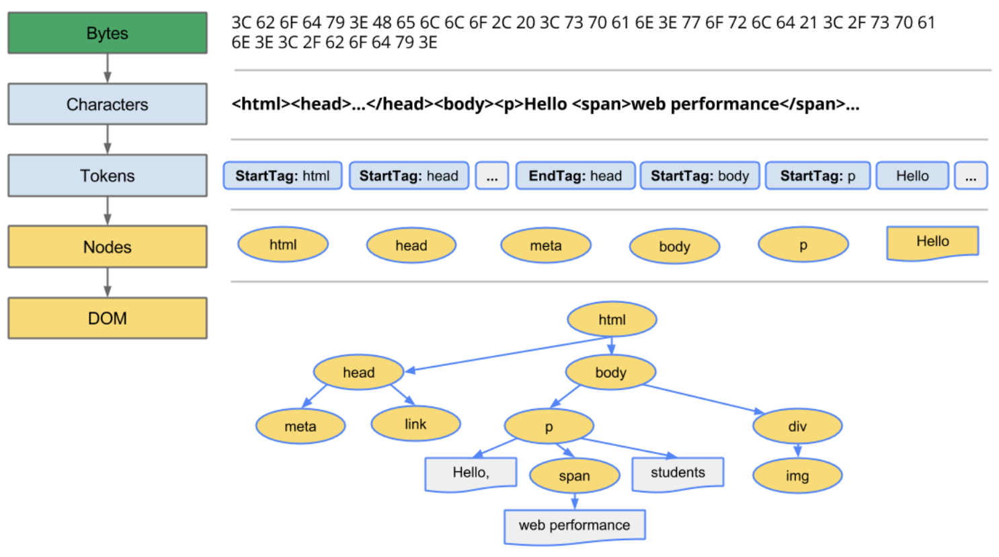
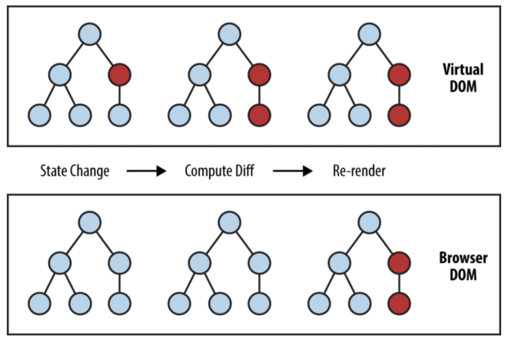
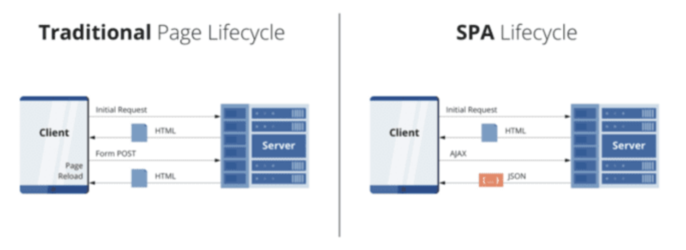

# 1장 리액트 프로젝트 시작하기

## 리액트란?

- UI = render(state)
  ⇒ UI를 현재 상태정보에 따라서 화변에 보여주는 것

 

## 돔트리(DOM tree)와 가상돔(Virtual DOM)

 

### DOM(Document Object Model)

말 그대로 문서(html)을 객체로 표현한 모델이다. JSON(Javascript Object Model)이나 ORM(Object Relational Mapping)을 생각하면 이해하기 쉽다. 이는 HTML요소를 자바스크립트를 사용하여 동적으로 조작하려고 만들어진 개념이다.

돔요소에 변경사항이 발생하면 렌더를 해주어야 유저가 보는 화면에 변경사항이 적용되는데 기존의 돔구조에서는 일부분만 변경이 돼도 변경되지 않은 부분까지 전부 렌더래주어야 했으므로 비효율적이었다. 이를 극복하기 위해서 생각해낸 개념이 가상돔이다.

 

### Virtual DOM

돔트리 이외에 가상돔을 형성해 돔요소의 상태에 변경이 발생하면 이를 가상돔에 반영하고, 기존의 돔트리와 대조하여 변경된 부분만 확인하여 렌더를 해준다. 이렇게 기존의 돔트리의 비효율성을 극복할 수 있다.

 

## JSX와 Babel

 

### JSX

가상돔 사용의 문제점 중 하나는 가독성이 떨어지게 된다는 점이다. 가상돔을 만드는 과정에서 `createElement`와 같은 함수를 사용하게되는데 이는 네스팅이 가득한 트리구조에서 가독성의 심각한 저하를 가져온다. 이를 극복하기 위해서 나온것이 바로 JSX이다. JSX문법을 사용하면 가독성을 획기적으로 극복하면서 가상돔을 구현 할 수 있다.

하지만 브라우저에서는 JSX문법을 그대로 인식할 수 없다. 그래서 JSX로 작성된 언어가 브라우저에서 인식할 수 있도록 트랜스파일링 해주는 바벨(Bable)이라는 패키기가 필요하다.

 

### Babel

바벨은 원래 ES6+문법으로 작성된 자바스크립트 파일을 ES5문법의 코드로 바꿔주는 트랜스파일러이다. ES6문법이 처음 나왔을 때 브라우저 별로 새로운 기능을 지원하는 곳도 있고 지원하지 않는 곳도 있었다. 여러 브라우저에 서비스하기 위해서는 브라우저별로 다른 코드를 작성해야만 했고 이는 비효율성을 초래했다. 하지만 밥벨 덕분에 새로운 문법으로 한 번만 작성하면 브라우저 지원상황에 맞춰 서비스가 가능했다.

여기서는 가독성개선을 위해 만들어낸 JSX라는 신문법을 브라우저가 이해할수 있는 자바스크립트로 변환해주는 데에 바벨이 사용된다.

 

## 웹팩(Webpack)

웹팩은 오픈소스 자바스크립트 모듈 번들러로서 프로그램을 배포하기 좋은 형태로 묶어주는 도구이다. 기존에는 웹사이트에 파일이 그렇게 많지 않고 복잡하지도 않았다. 하지만 SPA(Single Page Application)이 등장하면서 자바스크립트 파일의 개수와 복잡성이 기하급수적으로 증가했다. 이에 따라서 파일같의 의존성문제도 해결하면서 배포하기 쉽도록 하나의 파일로 합쳐주는 웹팩이 등장하게 된다.

큰 양의 파일을 하나로 합치면 로드시에 오래걸리거나 부하가 있을 수도 있다. 그래서 이를 극복하기 위해서 chunk, code split, cache 등을 활용한다.

웹팩은 ESM(ES6의 모듈시스템)와 common.js를 모두 지원한다.

- ESM ⇒ import, export
- common.js ⇒ require()

 

## 툴체인(toolchain)

툴체인이란 소프트웨어를 개발하는데 필요한 도구들의 집합이다. 보통 초기 개발환경을 구축하고 개발 및 배포를 도와주는 라이브러리들을 모아서 설치 및 세팅해준다. 리액트로 개발을 하기 위해서 필요한 툴체인에는 대표적으로 아래와 같다.

- CRA(create-react-app) : 리액트 학습시, 빠른 개발게 개발시작을 원할 시
- Next.js : 서버사이드 렌더링 Node.js 웹사이트를 개발할 시
- Gatsby : 정적 콘텐츠를 주로하는 웹사이트 개발 시

 

### CRA(create-react-app)

리액트로 웹 어플리케이션을 만들기 위한 환경을 제공한다. 참고로 리액트 네이티브에는 expo가 있다. CRA에는 webpack, babel, jest, HMR(hot-module-replacement: 라이브서버같은 기능)등의 라이브러리가 기본으로 내장되어있다.

 

## 알아두면 좋은 개념

 

### 폴리필(polyfill)

브라우저에서 지원하지 않는 기능을 구현하기 위해서 추가적으로 작성하는 코드를 말한다. 직접 설치하고 적용하는 방법도 있고, 바벨을 통해서 사용하는 방법도 있다. 폴리필을 사용하다보면 사용되지 않는 기능의 폴리필 코드도 포함되는 경우가 발생한다. 그래서 기능이 존재하는지 검사해서 존재하지 않는 경우에만 주입해주는 방식으로 최적화 할 수도 있다.

 

### 코드분할(code splitting)

코드분할은 처음부터 import해서 전체 코드를 다운받도록 하는 것이 아니라, 해당 코드가 필요한 시점에 코드를 동적으로 import하여 유저가 처음 화면을 내려받을 때 걸리는 시간을 줄여주도록 돕는 스킬이다.

 

### 환경변수

CRA에는 **빌드시점**의 환경변수를 코드로 전달할 수 있다. 또한 CRA에서는 NODE_ENV가 기본제공된다. 실행환경에 다라서 development, test, production이라는 텍스트값을 불러올 수 있어서 실행환경이 무엇인지에 따라 다르게 반응하는 코드를 짤 수 있다. 리액트에서 기타 환경변수를 사용하기 위해서는 환경변수파일의 변수명 앞부분에 반드시 `REACT_APP`을 붙여야한다. 사용할 때는 `process.env.환경변수파일명`으로 사용한다.

.env파일은 파일명을 .env.developtment, .env.test, .env.production 같이 작성해서 사용하면 해당 환경에 따라 다른 환경변수파일을 불러와서 사용할 수 있다.

 

### autoprefixer

CSS 최신기능을 사용하기 위해서는 벤더접두사를 붙여야한다. CRA에 포함된 autoprefixer는 자동으로 벤더접두사를 붙여준다. 따라서 별도로 고민할 필요가 없다.

 

## CSS 작성방법

CRA 기반 리액트 환경에서 CSS를 작성할 수 있는 방법에는 대표적으로 3가지가 있다.

- CSS module
- SASS
- Styled components

최근에는 SASS 또는 styled-components 중에 하나를 사용하는 추세인것 같다. 여기는 실제로 코드 작성하면서 배우는게 가장 빠르다. 개념만 짚자면 SASS는 좀 더 효율적으로 CSS코드를 작성하기 위해 네스팅, mixin, extend 등의 기능을 제공하고, styled-components는 자바스크립트 코드로 CSS를 작성하면 동적인 스타일링에 특화된 환경을 제공한다.

 

## SPA(Single Page Application)

기존의 전통적인 방식으로는 페이지가 바뀌면 서버에 HTML파일을 요청했고 그때마다 새롭게 페이지를 새로고침했다. 하지만 SPA방식으로 웹사이트를 구현하면 페이지 정보인 HTML은 최초에 한 번만 받아오고 그 이후에는 변경에 필요한 데이터 및 파일만 받아온다.

장점으로는 페이지 로딩속도가 빠르고, 사용자 경험이 매끄럽고 우수하다는 점이다. 하지만 최초 로딩속도가 느리고, SEO에 적합하지 않을 수 있다는 단점도 있다.

여기서 SEO문제를 해결하기 위해서 서버사이드렌더링(SSR)을 채택할 수도 있다. 그리고 SSR을 위해서 사용하는 가장 대표적인 툴체인이 NEXT.js이다.

 

### history API

히스토리 API는 브라우저에서 기본제공되는 API로 싱글페이지 어플리케이션을 구현하기 위해 꼭 필요한 기능을 제공한다. 브라우저 히스토리에 상태값을 저장하는 스택(Stack)이 존재하여 pushState, replaceState, popState등으로 상태값을 변경할 수 있다.

 

### react-router-dom

history API를 기반으로 SPA사이트에서 라우팅 및 페이지 전환을 쉽게 할 수 있도록 도와주는 라이브러리다. 최근 v6업테이트와 함께 hook기반으로 사용법이 변경되었다.

 

## 참고

- [https://junilhwang.github.io/TIL/Javascript/Design/Vanilla-JS-Virtual-DOM/#\_1-가상돔-virtualdom-만들기](https://junilhwang.github.io/TIL/Javascript/Design/Vanilla-JS-Virtual-DOM/#_1-%E1%84%80%E1%85%A1%E1%84%89%E1%85%A1%E1%86%BC%E1%84%83%E1%85%A9%E1%86%B7-virtualdom-%E1%84%86%E1%85%A1%E1%86%AB%E1%84%83%E1%85%B3%E1%86%AF%E1%84%80%E1%85%B5)
- [https://www.ascentkorea.com/seo-for-spa/](https://www.ascentkorea.com/seo-for-spa/)
