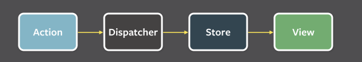

# 리덕스로 상태관리하기

**사용하는 이유**

1. 컴포넌트로 부터 상태관리 코드를 분리할 수 있다. (커스텀훅을 이용해 완전히 분리 할 수도 있다.)
2. store에 이미 직렬화 해서 state를 저장하기에 로컬스토리지에 쉽게 데이터를 저장 할 수 있다, 페이지가 전환되어도 state 유지
3. 동일한 상태값을 여러 컴포넌트에서 참조할 때 좋고, 프롭스 드릴링이 없다.
4. 서버 렌더링 시 데이터 전달이 간편하다.

<br>

## 리덕스 3원칙

1. **전체 상태값은 하나의 객체에 저장**

리덕스는 하나의 객체를 직렬화 해서 서버-클라이언트가 전체 상태값을 주고 받는다.

`직렬화`란 객체를 데이터 스트림에 쓰기 위해 연속적인 형태로 변환하는것으로 역직렬화를 통해 원본으로 다시 바꿀 수 있다.

모든 상태값을 리덕스로만 관리한다면, 모든 상태값을 알고 있기에 전 상태와 후 상태를 비교해 시간여행과도 같은 기능을 구현할 수 있다.

2. **상태값은 불변객체로 관리한다**

상태값은 오직 액션 객체에 의해서만 변경된다.  
(액션 객체는 type 프로퍼티를 갖는 그냥 자바스크립트 객체이다.), 리액트 자체적으로도 불변객체는 아니지만 불변객체로 관리하는걸 권장한다.

3. **상태값 변경은 순수함수에 의해서만**

순수함수는 side effect가 없고, 같은 인자에는 같은 결과가 나오는 함수이다.  
그렇기에 리덕스는 항상 같은 파리미터에 같은 결과가 나오기에 replay 기능을 쉽게 구현할 수 있다.

cf) `new Date(), random()` 는 순수함수가 아니다.

<br>

## 주요 개념

리덕스는 액션, 미들웨어, 리듀서, 스토어만 알면 바로 실 사용이 가능하다.

### flux

리덕스는 flux 패턴에 기반한 라이브러리이다.
flux는 페이스북에서 소개한 아키택쳐로, 유지보수가 쉽다.


- **단방향 데이터 흐름**이라 예상 가능하다.
- dispatcher를 통해 action이 발생하면, 관련된 모든 view가 바뀐다.
- 디스패쳐, 스토어, 뷰 = flux

(vue는 양방향 데이터 바인딩이 가능하다)

<br>

### 액션

액션은 type 속성을 가진 평범한 자바스크립트 객체이다. 보통은 `리듀서의 이름/동작`으로 명명한다.

액션 객체를 dispatch 메소드에 넣는다면, 상태를 변경할 준비 끝!  
액션 객체는 type 이외에도 다른 속성들을 받아 상태 변경에 이용할 수 있다.

보통은 액션 객체를 그냥 만들지는 않고, 액션 객체 생성 함수를 통해 만든다. 항상 같은 파라미터를 받기 위해서 강제하는 편이고 하나의 컨벤션이다.

말은 어렵지만, 필요한 파라미터를 받아, 액션 객체를 반환하는 함수다.

**그래서** 리덕스의 액션을 만들땐

1. 액션 타입을 지정하는 상수와,
2. 액션 생성 함수가 필요하다.

```jsx
export const ADD = 'todo/ADD';
export const REMOVE = 'todo/REMOVE';

export const addTodo = ({ title, priority }) => {
  return { type: ADD, title, priority };
};
```

(액션 객체에서 type 이외의 속성들은 payload로 불린다.)

<br>

### 미들웨어

액션이 발행 되고 나서, 리듀서가 액션을 처리하기 전에. 상태가 바뀌기 전에 실행되는 함수이다.  
상태값 변경시 로그 출력, 예외를 서버로 전송하는 등 여러가지 기능을 수행한다.

실질적인 미들웨어 설정법

```jsx
import { createStore, applyMiddleware } from 'redux';

const customMiddleware = store => next => action => {
  console.log('미들웨어 시작');
  const result = next(action);
  console.log('미들웨어 끝');
  return result;
};

const store = createStore(rootReducer, applyMiddleware(customMiddleware, logger));
```

툴킷에서의 미들웨어 등록

```jsx
export const store = configureStore({
  reducer: persistReducer(persistConfig, rootReducer),
  middleware: [logger, saga - middleware],
});
```

여러가지 미들웨어

```jsx
1. logger 기능

const printlog = store => next => action => {
  console.log(store.getState())
  const result = next(action)
  console.log(store.getState())
  return next
}
// next호출을 기점으로 위에선 전 상태 밑에선 후 상태가 나온다

2. 에러 전송

const reportCrash = store => next => action => {
  try{
    return next(action)
  }catch(e){
    //서버로 전송 코드
  }
}

3. 연기

!(action.delay){
  return next(action);
}
```

<br>

### 리듀서

**(action, state) => nextState**  
액션 발생 시 새로운 상태값을 만들어 주는 함수이다.  
만든 리듀서들을 합쳐 rootReducer를 만들고, 이를통해 store객체를 만든다.  
이렇게 만들어진 store는 dispatch 함수를 통해 action을 전달받으면 해당하는 타입의 리듀서를 동작시킨다.

실질적인 리듀서 작성 예

```jsx
function counter(state = INITIAL_STATE, action) {
  switch (action.type) {
    case 'INCREASE':
      return state + 1;
    case 'DECREASE':
      return state - 1;
    default:
      return state;
  }
}
```

복잡한 객체의 경우 immer를 사용해 전개연산자를 많이 사용하지 않도록 한다.(가독성을 좋게 한다)  
리듀서는 순수함수여야 하기 때문에, side effect가 있는 api콜과 랜덤함수 호출은 불가능하다.

리듀서들을 합칠때에 combineReducer를 사용한 뒤에 createStore안에 넣어주는데, **toolkit에 생긴 configureStore**함수는 안에 reducer라는 프로퍼티로 넣어준 객체를 combineReducer에 넘기기 때문에 combine 해주지 않아도 된다.

<br>

### 스토어

리덕스 전체의 상태값을 가지는 객체이다.

1. 스토어 함수가 가지는 dispatch 함수를 통해 받은 액션으로 리듀서를 동작시켜 상태를 변경한다.
2. 스토어는 subscribe 라는 함수를 갖는다. 콜백함수를 받아 dispatch가 실행될 떄 마다 콜백을 호출한다. (로그 찍기에 유용한다.)

**덕스 패턴**  
리덕스와 발음이 비슷해 지어진 이름처럼 보인다.
액션 상수와, 액션 생성함수, 리듀서 함수를 하나의 파일에서 관리하는 패턴
export default로 리듀서를 export로 액션 상수를 내보낸다.

<br>

## 리액트 상태값을 리덕스로 관리하기

사실, 리덕스는 리액트 뿐 아니라 자바스크립트를 쓰는 모든곳에서 redux를 사용할 수 있다. -> react-redux 패키지 없이 redux 패키지 만으로 구현할 수 있다.

<br>

### redux 패키지만으로 전역상태관리 구현

1. createStore, combineReducer를 통해 스토어를 만들어준다.
2. 컴포넌트에서 사용시, store 객체를 import하고 `store.subscribe`와 useEffect를 통해 dispatch가 일어날 때마다 view를 바꿔준다.
3. `store.dispatch`안에 액션 생성함수를 전달하면 state를 바꾼다.
4. `store.getState`를 통해 state를 조회한다.

<br>

### react-redux를 통해 전역상태관리 구현

1. `Provider` 컴포넌트로 전체를 감싸주면, 리덕스 상태값 변경시 컴포넌트 함수가 호출되도록 한다.
2. `useSelector`훅으로 상태를 조회한다. **리덕스의 상태값이 변화되면, 이전상태와 이후 상태를 비교해 달라진 경우만 랜더링한다.** 받는 콜백함수가 반환하는 값이 그대로 훅의 반환값이 된다.
3. `useDispatch`훅으로 액션을 발생시킨다.

<br>

`useSelector`훅의 경우 한가지 이상의 상태값을 가져오고 싶을땐, 콜백함수가 객체를 리턴해야 되는데, , 이러면 계속 객체가 만들어진다.  
-> 메모이제이션 훅사용, useSelector를 여러번 사용, useSelector의 두번째 매개변수 활용

메모이제이션을 위해 reselect를 사용한다.
useSelector의 두번쨰 매개변수는 컴포넌트의 랜더링 여부를 판단한다. 그래서 react-redux가 제공하는 shallowEqual 함수를 넣어준다. 자주 쓴다면 둘이 묶어서 커스텀훅을 만든다.

```jsx
  import {shallowEqual} from 'react-redux'

  export default fucntion MC(){
    const [v1,v2,v3] = useSelector(
      state => [state.v1,state.v2,state.v3],shallowEqual
    )
  }
```

<br>

## reselect

원본 데이터를 다양한 형태로 가공해서 사용할 수 있도록 도와준다.
리덕스 데이터 -> 컴포넌트에서 필요한 데이터로 가공, 메모이제이션 기능이 있다.

```jsx
const activeListSelector = createSelector(
  state => state.friend.friends, // 상태 1 리턴 함수
  state => state.friend.ageLimit, // 상태 2 리턴 함수

  // 상태 1, 2, 3이 차례로 들어간다
  (friends, ageLimit) => friends.filter(friends=>friend.age<=ageLimit>)
);
```

속성값 넘기기도 가능하다.
컴포넌트가 여럿이 될 경우, 메모이제이션 기능이 제대로 동작하지 않는데, 선택자 함수(createSelector의 콜백함수들)도 여럿 만들어 주면 된다.

<br>

## saga

비동기 액션을 처리하는 방법중 하나. 제너레이터를 기반으로 만들어졌다. 사가에서 모든 부수효과는 리덕스의 액션 객체처럼, 자바스크립트 객체로 표현된다.

### 시작

1. 덕스 패턴으로 만든 리덕스 관련 파일로 들어간다.
2. 액션 타입 상수들을 한 객체에 담아 export한다. saga에서 쓰기 때문.
3. 액션 생성자 함수도 객체에 담아 내보낸다 (이미 상수들을 객체로 내보냈기에)

사가에서는 API통신, 리덕스 액션 발생 등 부수효과를 허용한다. 단 이를 누리려면 사가의 부수효과 함수를 이용해야 한다.  
부수효과 함수를 이용해 하나의 완성된 로직을 담고 있는 함수를 사가 함수라고 칭한다.

### 사가함수 작성

```jsx
import { all, call, put, take, fork } from 'redux-saga/effects';
import { actions, types } from './index';
import { callApiLike } from '../../common/api';

export function* fetchData(action) {
  while (true) {
    const { timeline } = yield take(types.REQUEST_LIKE);
    yield put(actions.setLoading(true));
    yield put(actions.addLike(timeline.id, 1));
    yield call(callApiLike);
    yield put(actions.setLoading(false));
  }
}

export default function* watcher() {
  yield all([fork(fetchData)]);
}
```

동일하진 않지만, 쉽게 생각한다면  
take: 액션 타입을 받아서, 액션 객체를 반환한다. 단 액션이 발생해야 그 다음줄의 코드가 실행된다. 기다리는 역할.  
put: 디스패치  
call: 동기/비동기 함수 실행하고 동기처럼 기다림  
all,fork: 사가 미들웨어에 등록을 위해 여러 사가 함수를 모아놓기 위한 함수들

put 함수를 **실행했다고**, dispatch 메서드가 즉시 실행되지 않는다. 반환값은 앞으로 해야 할 일들을 설명하는 객체이다. 이것들은 사가 미들웨어 객체에 전달되어 해야할 일들을 한다.

### 두가지 이상 액션이 있는 사가함수

위에서 부터 코드가 실행되고, take는 액션이 발생할 때 까지 기다린다. 이를 바탕으로 두개 이상의 액션을 처리 할 수 있다.

### 예외 처리

트라이-캐치를 통해, 미리 정의한 액션을 put한다.

### 테스트

@redux-sage/testing-utils 패키지 인스톨  
부수효과가 잘 발생하는지 테스트 할 수 있다.  
cloneableGenerator 를 임포트해, 제너레이터 객체를 복사해 jest로 테스트한다.

[보일러 플레이트](https://github.com/wecode-bootcamp-korea/react-redux-example/blob/4d9cad9c10213b1c4455179ea5f3cd1d954a50f5/src/components/Main.js)
